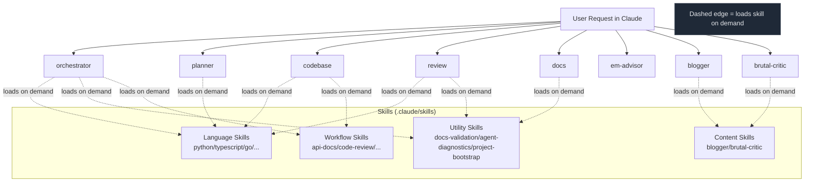

# Agents

Lean reference for the built-in Claude subagents.

## Why these agents

- **Clear separation of roles** so you can pick the right depth quickly.
- **Safer behavior by default** through least-privilege tools and settings guardrails.
- **Faster handoffs** across planning, implementation, review, and docs.

## Agent Overview

| Agent | Best For | Allocated Skills (summary) |
|-------|----------|----------------------------|
| `@orchestrator` | Multi-phase coordination | Language skills + utility skills + `blogger`/`brutal-critic` |
| `@planner` | Read-only architecture/planning | Language skills + utility skills |
| `@codebase` | Feature implementation | Language skills + `sql-migrations` |
| `@review` | Security/performance/code quality | Language skills + `docs-validation` + `agent-diagnostics` |
| `@docs` | Documentation updates | `docs-validation` + `project-bootstrap` + `agent-diagnostics` |
| `@em-advisor` | Engineering leadership guidance | `project-bootstrap` + `docs-validation` + `agent-diagnostics` |
| `@blogger` | Blog/video/podcast drafts | `blogger` + `brutal-critic` |
| `@brutal-critic` | Final content quality gate | `brutal-critic` + `blogger` |

See exact allowlists in the [Skills Matrix](../skills-matrix).

## Suggested Flow

```
@orchestrator (plan)
→ @codebase (implement)
→ @review (audit)
→ @docs (document)
```

## Agent ↔ Skill Relationship (Quick Diagram)

> Tip: if labels look small, scroll horizontally in the diagram container.



If Mermaid does not render in your docs host, the flow still reads top-to-bottom:

`@orchestrator/@planner/@codebase/@review/@docs/@em-advisor/@blogger/@brutal-critic` → load relevant skills on demand.

## Skill Usage Guardrails

- All built-in agents support skills.
- Skills are loaded on demand (not eagerly).
- Use one relevant skill per phase by default; add another only for clear cross-domain dependencies.
- If stack/domain is unclear, clarify before loading.

## Permission Model

- Use `.claude/settings.json` for shared permission policy.
- Use hooks for deterministic enforcement of risky operations.
- Keep agent tool lists minimal and role-specific.

## Skill Scope Policy (Current)

- Keep current **core-only** skill scope.
- Add skills only with repeat demand, clear gap, owner, and clean licensing/provenance.

## Next Steps

- **[Commands & Skills](../commands)**
- **[Coding Standards](../instructions)**
- **[Customization](../customization)**
